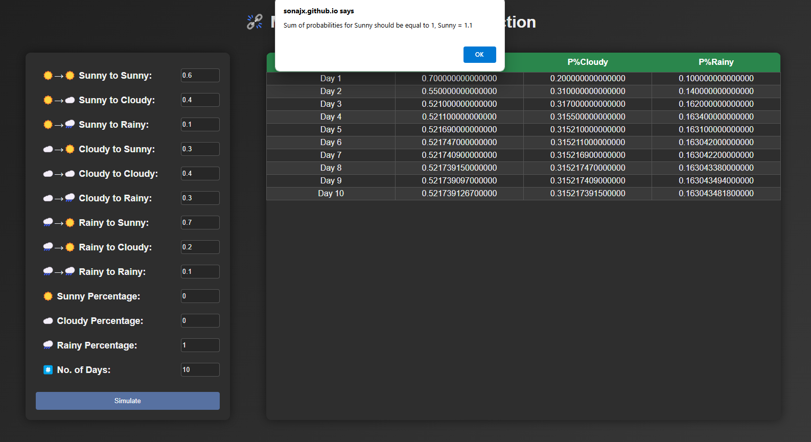
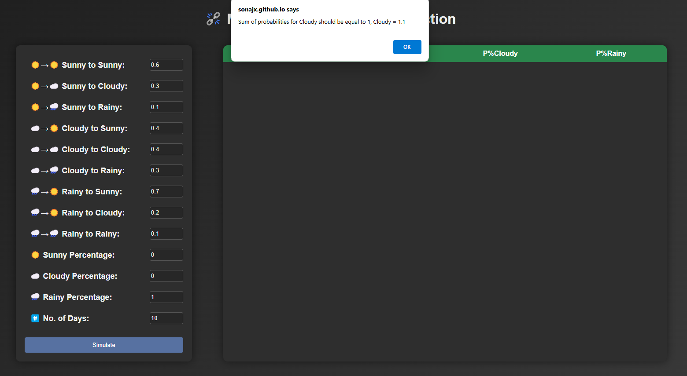
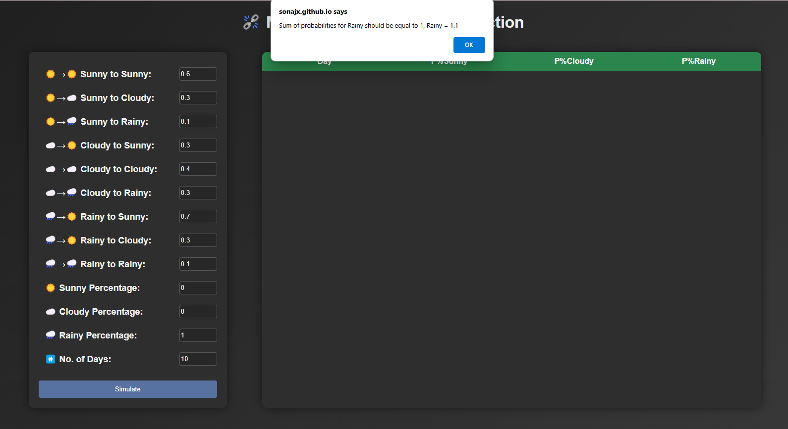
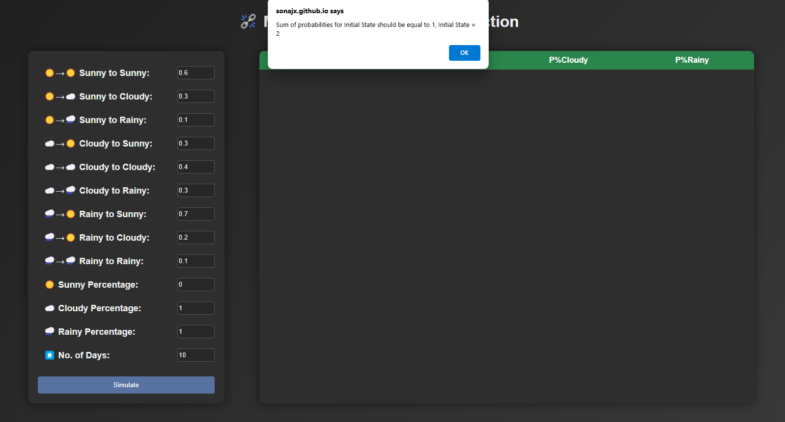
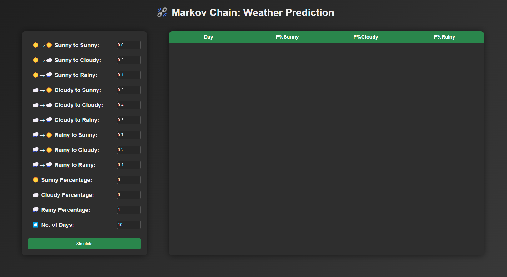
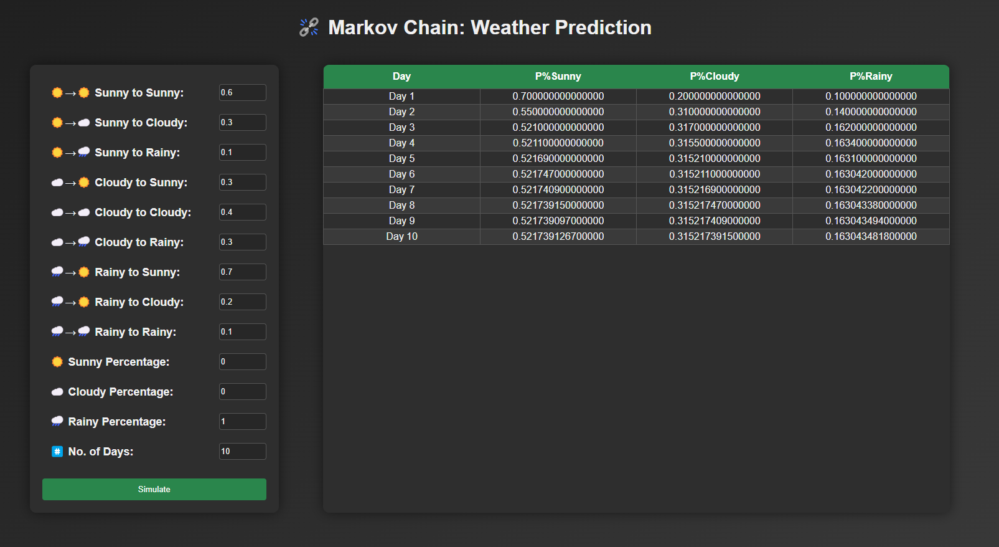
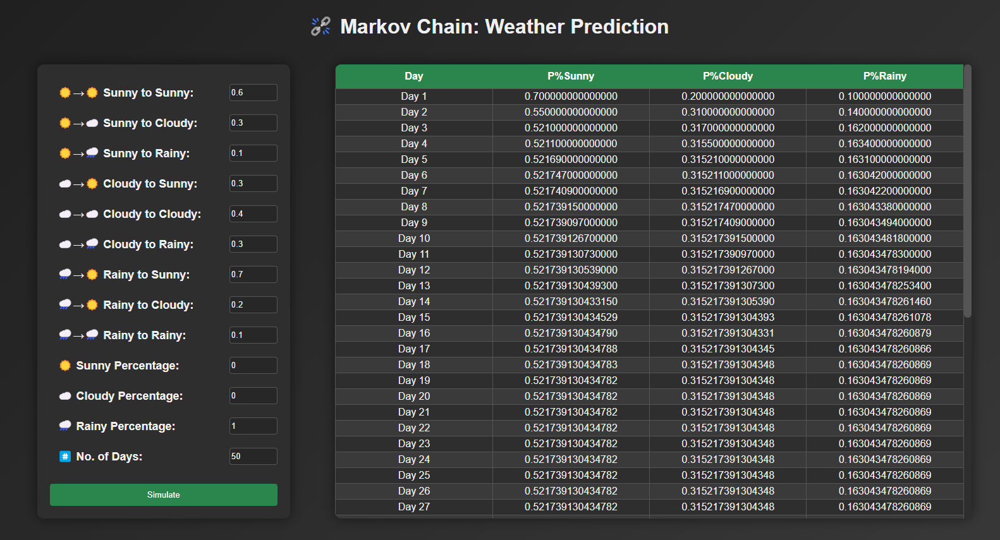

# Weather-Simulation-Using-Markov-Chain

Markov Chain-based Weather Prediction A probabilistic model for forecasting weather patterns using state transitions.

## Field Validation

### When the sum of probabilies is not equal to 1

#### Sunny

#### Cloudy

#### Rainy

#### Initial State

### Front-End Design

### Functioning Markov Chain

### reached the State of Equilibrium at Day 19

## Contributing

Contributions are welcome! Please fork this repository, create a new branch, and submit a pull request.
